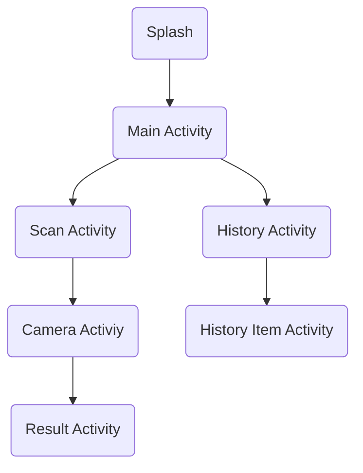

# Introduce
Currency Sense is an application made to facilitate blind people in identifying currencies through mobile phones, this application is made using Kotlin programming language, TensorFlow Lite, and other libraries.

## Program Flow

